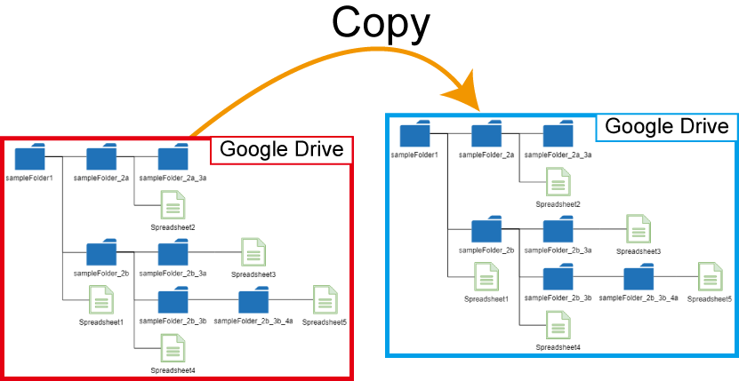

# CopyFolder

<a name="top"></a>

[](LICENCE)

<a name="overview"></a>

# Overview

**This is Google Apps Script library for copying folder on Google Drive.**



<a name="description"></a>

# Description

I have sometimes the situation that it is required to back up the folder on Google Drive to Google Drive. But unfortunately, the method of [`makeCopy()`](https://developers.google.com/apps-script/reference/drive/file#makecopy) of Class File and the method of [`Files: copy`](https://developers.google.com/drive/api/v3/reference/files/copy) of Drive API cannot be used for directly copying the folder on Google Drive. So I created this as a library. This library can copy the folder on Google Drive. All files in the folder can be copied to Google Drive with keeping the folder structure. When there are the files with newer modified time in the source folder than those in the destination folder, the files in the destination folder are overwritten by the newer files in the source folder. Also, in this library, the folders in the shared Drive and the publicly shared folders can be used as the destination folder.

<a name="methods"></a>

# Methods

| Method                                              | Description                                                                                                                                                                                 |
| :-------------------------------------------------- | :------------------------------------------------------------------------------------------------------------------------------------------------------------------------------------------ |
| [copyAllFilesFolders(object)](#copyallfilesfolders) | Copy the folder from the source folder ID to the destination folder ID. In this case, all files and folders in the source folder are copied by keeping the folder structure.                |
| [copyOnlyFiles(object)](#copyonlyfiles)             | Copy the files from the source folder ID to the destination folder ID. In this case, the files just under the source folder are copied. So the folders in the source folder are not copied. |

# Library's project key

```
1LV7u9yCHVQFRvgDvbkWNZIgU5Ysjzdez7a508Nom0E4f5xzkM0AURH6Y
```

# How to install

- Open Script Editor. Click as follows:
- -> Resource
- -> Library
- -> Input the Script ID in the text box. The Script ID is **`1LV7u9yCHVQFRvgDvbkWNZIgU5Ysjzdez7a508Nom0E4f5xzkM0AURH6Y`**.
- -> Add library
- -> Please select the latest version
- -> Developer mode ON (Or select others if you don't want to use the latest version)
- -> The identifier is "**`CopyFolder`**". This is set under the default.

[You can read more about libraries in Apps Script here](https://developers.google.com/apps-script/guide_libraries).

## Enable Drive API

**In this library, Drive API is used. So [please enable Drive API at Advanced Google services](https://developers.google.com/apps-script/guides/services/advanced#enabling_advanced_services).**

## About scopes

This library uses the following scope. This is installed in the library, and nothing further is required from the user.

- `https://www.googleapis.com/auth/drive`
- `https://www.googleapis.com/auth/script.external_request`

## Additional libraries

This library also uses the following 2 GAS libraries.

- [FilesApp](https://github.com/tanaikech/FilesApp)
- [BatchRequest](https://github.com/tanaikech/BatchRequest)

# Methods

<a name="copyallfilesfolders"></a>

## 1. copyAllFilesFolders(object)

This method is used for copying the folder from the source folder ID to the destination folder ID. In this case, all files and folders in the source folder are copied by keeping the folder structure.

### Sample script 1

In this sample script, the folder is copied from `sourceFolderId` to `destinationFolderId`. This is the simple sample script for using this library.

```javascript
function myFunction() {
  const object = {
    sourceFolderId: "###", // Please set the source folder ID.
    destinationFolderId: "###", // Please set the destination folder ID.
    overwrite: true,
  };
  const res = CopyFolder.copyAllFilesFolders(object);
  console.log(res);
}
```

<a name="object"></a>

- **`sourceFolderId`** : Source folder ID. You can also use the folder ID of the shared Drive and the publicly shared folder.
- **`destinationFolderId`** : Destination folder ID. You can also use the folder ID of the shared Drive and the publicly shared folder.
- **`overwrite`** : When `overwrite: true` is used, when the modified time of files and folders in the source folder is newer than that of those in the destination folder, the files in the destination folder is overwritten by the files in the source folder. **But, in this case, the file ID is changed. Please be careful this.**

### Sample script 2

When there are a lot of files in the source folder, there is the case that the process time of the script is over the maximum execution time (6 minutes). In this case, the copy can be run using the time-driven trigger. The following sample script is used for this situation.

```javascript
const deleteTrigger = (functionName) => {
  ScriptApp.getProjectTriggers().forEach((t) => {
    if (t.getHandlerFunction() == functionName) ScriptApp.deleteTrigger(t);
  });
};

// Please run this function.
function main() {
  const functionName = "main"; // This function is the same with this function.

  try {
    const object = {
      sourceFolderId: "###", // Please set the source folder ID.
      destinationFolderId: "###", // Please set the destination folder ID.
      overwrite: true,
    };
    if (CopyFolder.copyAllFilesFolders(object).result == "done") {
      deleteTrigger(functionName);

      // For example, you can also send an email when the copy was done as follows.
      // MailApp.sendEmail({to: "###email###", subject: "From CopyFolder", body: "Done"});

      return "done";
    }
  } catch (e) {
    const nextRun = 10; // In this case, this function (main()) is run again, after 10 minutes.

    deleteTrigger(functionName);
    ScriptApp.newTrigger(functionName)
      .timeBased()
      .after(nextRun * 60 * 1000)
      .create();
  }
}
```

- When you run the function `main`, the script is run ahd copy the folder. When the process time of the script is over the maximum execution time, the script is run again after 10 minutes. When the copy is done, the script is finished and the time-driven trigger is deleted.

<a name="copyonlyfiles"></a>

## 2. copyOnlyFiles(object)

This method is used for copying the files from the source folder ID to the destination folder ID. In this case, the files just under the source folder are copied. So the folders in the source folder are not copied.

### Sample script

In this sample script, the files are copied from `sourceFolderId` to `destinationFolderId`.

```javascript
function myFunction() {
  const object = {
    sourceFolderId: "###", // Please set the source folder ID.
    destinationFolderId: "###", // Please set the destination folder ID.
    overwrite: true,
  };
  const res = CopyFolder.copyOnlyFiles(object);
  console.log(res);
}
```

About each property of `object`, you can see it at [here](#object).

## Limitations

- As the limitation, when there are several files with the same filenames in a folder, only one file is copied. Because the file ID of copied file is different from the source file and the filename is used instead of the file ID for checking the modified time.

  - But, for example, the source folder has 2 folders which are "folder A" and "folder B". And when the file with the filename of "sampleFile" is put in "folder A" and "folder B", respectively, both files are copied. Because the files with same filename are NOT put in one folder.

- When a lot of Google Apps Script projects try to be copied, several GAS files are put to the root folder and those are not moved to the destination folder, then, an error like `Transient failure` occurs. I think that this might be a bug. At that time, if the destination folder is not the root folder, please delete such files on the root folder. And then, please run the script again. By this, the left files are copied by comparing the source folder and the destination folder.

  - About this, when the error cannot be removed, as a workaround, please copy every several files.

- When an error of `userRateLimitExceeded` occurs, please wait for releasing it.

I sincerely hope this library is useful for you.

---

<a name="licence"></a>

# Licence

[MIT](LICENCE)

<a name="author"></a>

# Author

[Tanaike](https://tanaikech.github.io/about/)

If you have any questions or comments, feel free to contact me.

<a name="updatehistory"></a>

# Update History

- v1.0.0 (May 26, 2020)

  1. Initial release.

[TOP](#top)
